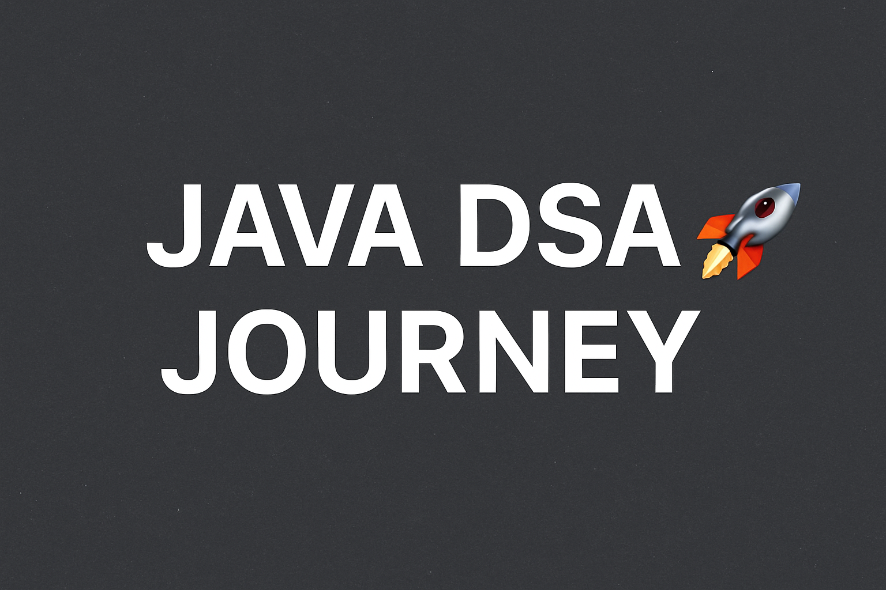

  

# Java DSA Learning Journey 🚀

Welcome to my **Java DSA (Data Structures & Algorithms)** learning repository!  
This space is dedicated to tracking my growth, projects, and understanding of DSA concepts using **Java**.

---

## 📚 About This Repository

- 🌱 I'm actively learning and practicing DSA concepts.
- 💻 The primary language used is **Java**.
- 🎯 Goal: Build strong problem-solving skills and master DSA for interviews, contests, and real-world applications.

---

## 📖 Topics Covered

- Arrays
- And more as I progress!

---

## 🛠️ Folder Structure
📁 DSA/ 
    ├── .idea/ 
    ├── scr/com/dpndr/
        └── LinearSearch/
    ├── .gitignore
    ├── DSA.iml
    └── README.md

---

## ✨ Why This Journey?

- To maintain consistency in learning.
- To build a strong foundation for future development and interview preparation.
- To document my progress and keep improving day by day!

---

## 🚀 How You Can Use This

- Clone the repo and practice along.
- Look into the code for better understanding and different approaches.
- Suggest improvements through pull requests or open issues for discussions.

---

## 📈 Progress Tracking

I'll keep updating this repository regularly as I solve new problems and learn new concepts!  
Stay tuned for more updates. 🚀

---

## 📬 Connect with Me

- **GitHub:** [github.com/dpndr](https://github.com/dpndr)
- **LinkedIn:** [linkedin.com/in/dpndr](https://linkedin.com/in/dpndr)

---

**Let's crack DSA together! 💪**

